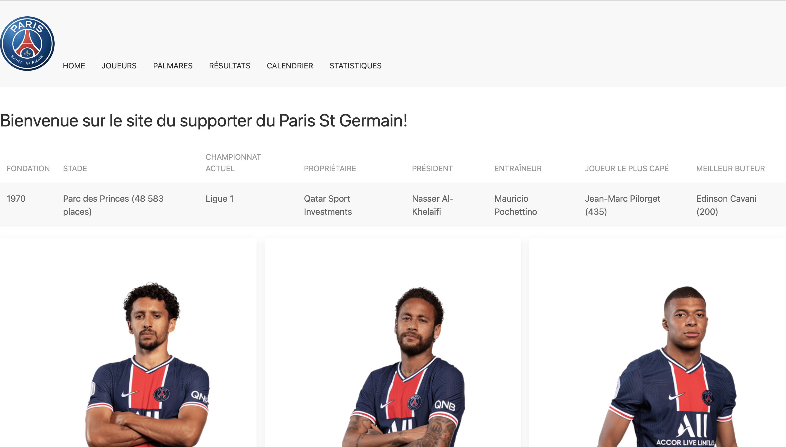
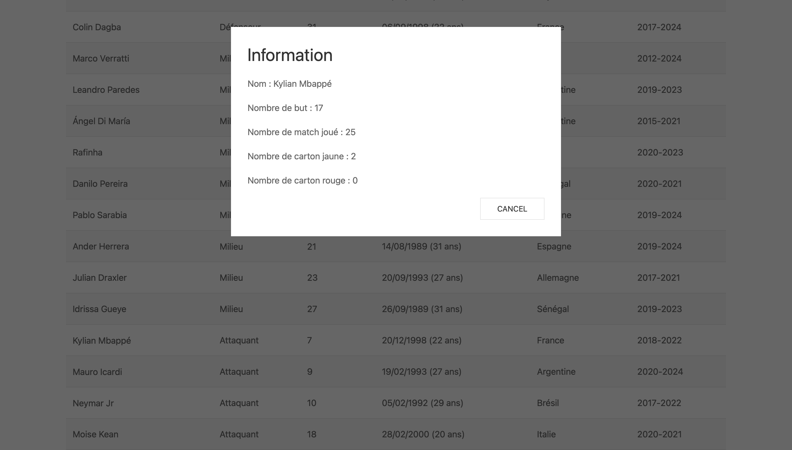
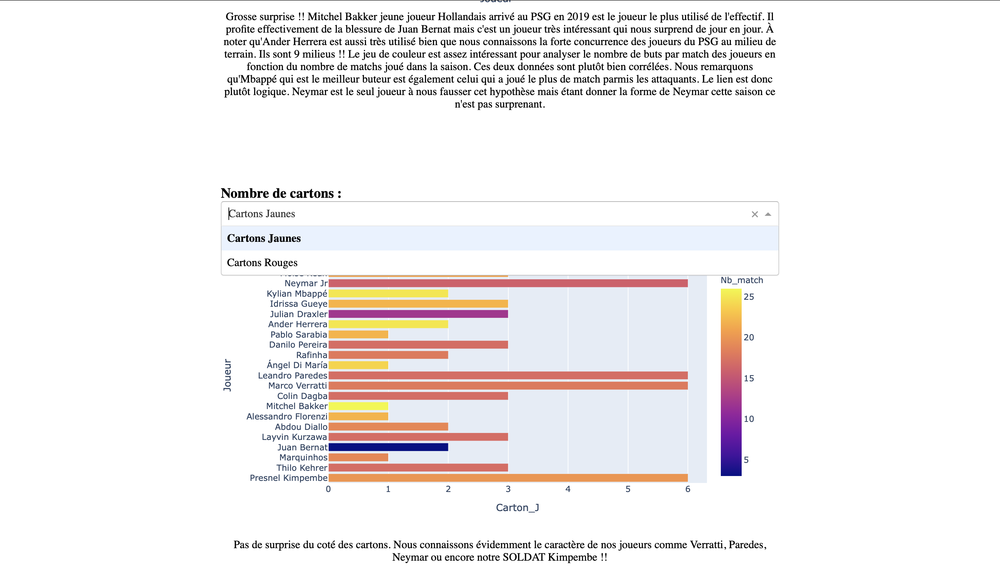

# Needed tools

## Git 

Vous devez récupérer le projet sur votre machine:

1.Créez un dossier depuis le terminal et mettez vous à la racine de ce dossier:

```
$ git clone https://github.com/maximemerat/DataEngineerTools.git
```

## Docker

Vous avez besoin de Docker pour lancer l'application.
Si vous ne l'avez pas sur votre machine, voici un tutoriel pour l'installer [Docker install page](https://www.docker.com/get-started)


# Lancement

Suivez les commandes suivantes pour ouvrir le projet:

1.Dans le terminal, placez vous à la racine du dossier precedement créé et tapez:
```bash
$ cd DataEngineerTools
```
2.Puis créez le conteneur Docker avec:
```bash
$ docker-compose up -d
```
3.Dirigez vous ensuite dans le dossier Projet:
```bash
$ cd 6Evaluation
```
```bash
$ cd Projet
```
4.Tappez la commande:
```bash
$ python3 run.py
```
5. Copiez ensuite l'adresse http et ouvrez l dans un navigateur.

Vous pouvez maintenant naviguer sur le site ! Enjoy !

## Page d'acceuil

<p align= "center">

</p>

Une fois le site lancé vous allez tomber sur cette page. Vous pouvez naviguer à travers
les différents onglets pour découvrir toutes les pages du site.

## Joueurs du Paris St-Germain

<p align= "center">

</p>

Lorsque que vous êtes sur la page des joueurs du Psg, vous avez la possibilité de cliquer sur un joueur pour voir ses statistiques.

## Graphiques 

<p align= "center">

</p>

Sur la page Statistiques vous avez des graphiques interactifs sur lesquels vous pouvez choisir les données que vous voulez afficher.

Je vous souhaite une bonne visite !
